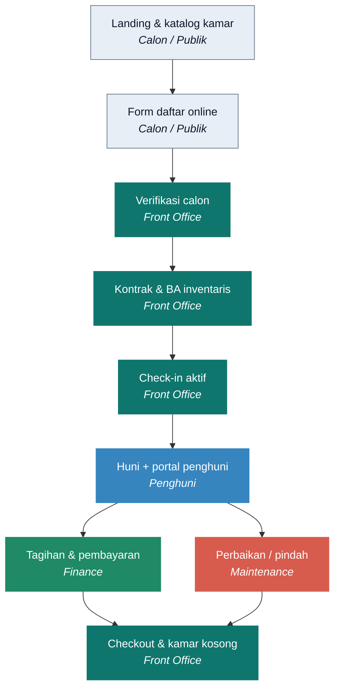
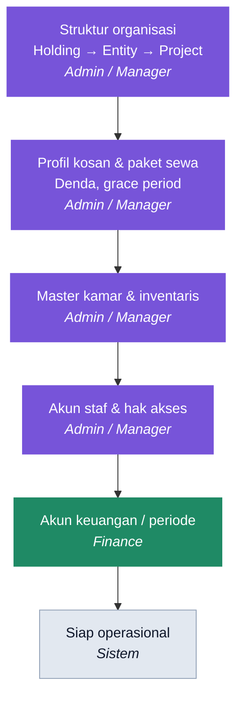
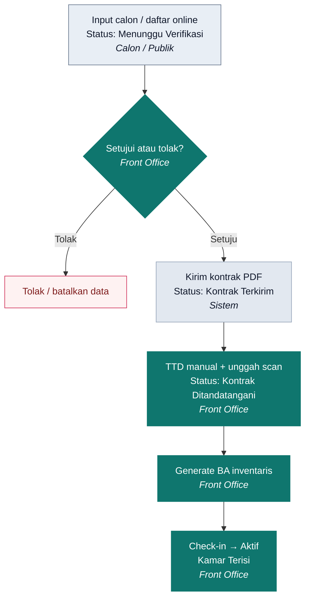
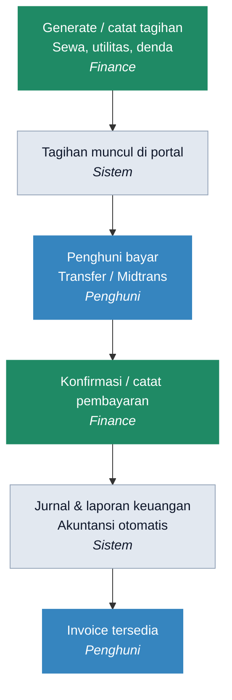
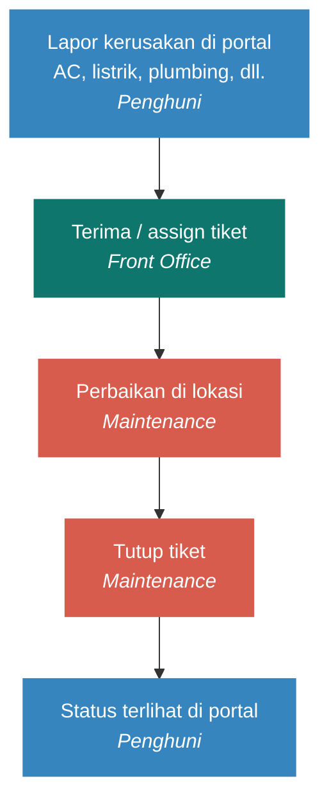
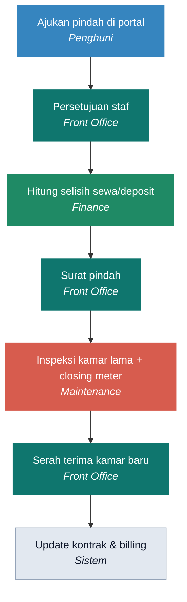
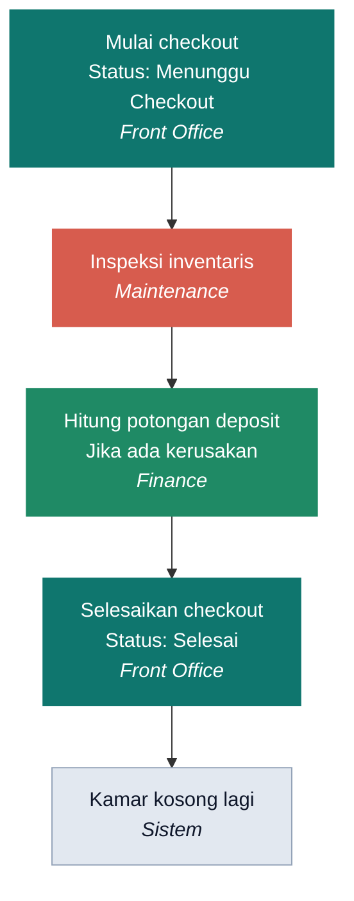

# KosanKu — User Flow (Presentasi Client)

Dokumen ini berisi flowchart Mermaid untuk presentasi ke client.  
Buka di GitHub / VS Code / Notion (dengan Mermaid), atau gunakan PDF: [`USER-FLOW.pdf`](./USER-FLOW.pdf).

---

## Ringkasan konsep

| Pintu masuk | Setelah login | Digunakan oleh |
|-------------|---------------|----------------|
| Landing publik | — | Calon penghuni |
| Dashboard | `/dashboard` | Staf (Admin, FO, Finance, Maintenance, Manager) |
| Portal | `/portal` | Penghuni aktif |

**Narasi 60 detik:** Calon melihat kamar di website → daftar → Front Office verifikasi & kontrak → check-in. Saat huni, penghuni bayar dan lapor perbaikan lewat portal; Finance mencatat uang; Maintenance menjaga aset. Saat keluar, inspeksi + deposit → kamar kembali kosong.

---

## 1. Big Picture — Siklus Hunian

---

## 2. Setup Awal (Go-Live)

---

## 3. Onboarding Penghuni (Kontrak)

---

## 4. Tagihan & Pembayaran

---

## 5. Permintaan Perbaikan

---

## 6. Pindah Kamar

---

## 7. Checkout Penghuni

---

## Matriks peran (ringkas)

| Peran | Fokus |
|-------|--------|
| **Super Admin / Manager** | Organisasi, setup, override, laporan |
| **Front Office** | Calon, kontrak, check-in/out, tiket |
| **Finance** | Tagihan, pembayaran, jurnal, laporan keuangan |
| **Maintenance** | Inventaris, utilitas, inspeksi, perbaikan |
| **Penghuni** | Portal: bayar, pindah, lapor rusak |
| **Calon (Publik)** | Katalog kamar & daftar online |

---

## File terkait

- Mermaid mentah (satu file per alur): folder [`docs/user-flow/mermaid/`](./user-flow/mermaid/)
- PDF presentasi: [`docs/USER-FLOW.pdf`](./USER-FLOW.pdf)
- HTML sumber PDF: [`docs/user-flow/presentasi.html`](./user-flow/presentasi.html)
